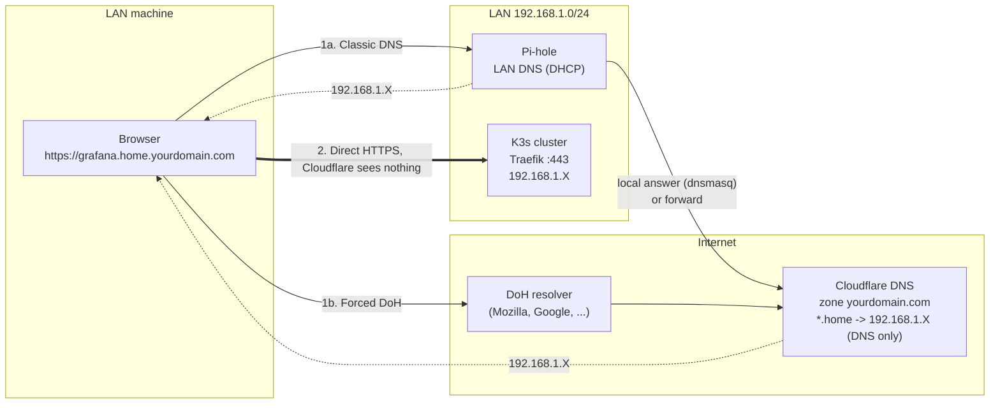
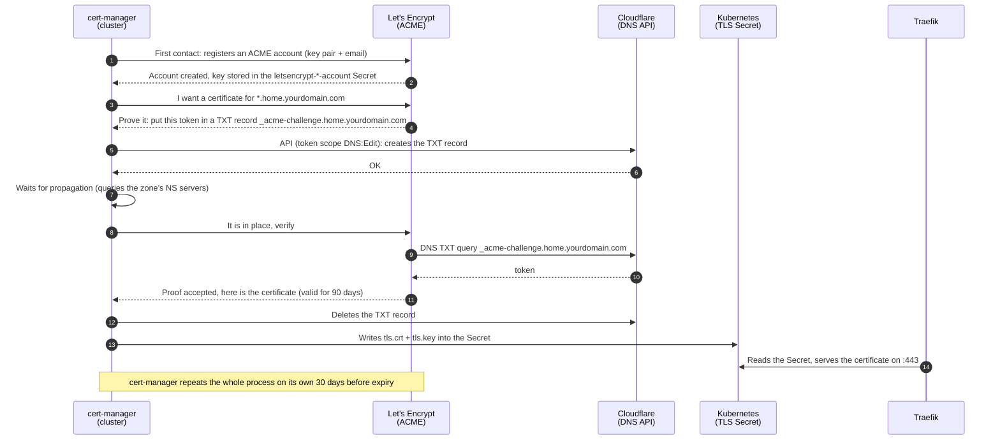
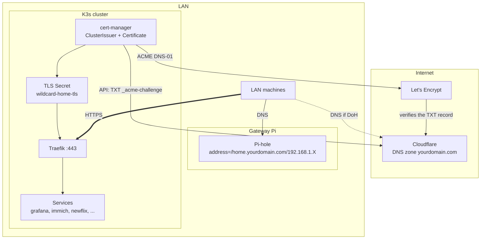

# Public domain, split-horizon DNS and Let's Encrypt certificates

How to reach the cluster services **from any machine on the LAN, without configuring anything on it**, using a real domain name and an HTTPS certificate trusted by browsers.

This document explains the mechanisms. The short operational version (deploy, add a service, debug) is in [`../docs/cert-manager.md`](../docs/cert-manager.md).

**Status**: deployed. Both issuers are ready, the production wildcard certificate is issued and set as the Traefik default certificate, and the first services (Immich, Newflix, the Docker registry) have an Ingress on the public name. The remaining services are migrated one at a time. In the manifests of this directory, `home.yourdomain.com` is written `${PUBLIC_DOMAIN}` and rendered by `scripts/render.sh`.

---

## The initial problem

Initially the services only answered on `*.${INTERNAL_DOMAIN}` (`grafana.${INTERNAL_DOMAIN}`, `immich.${INTERNAL_DOMAIN}`, ...), a made-up TLD that only Pi-hole knows about. This works as long as three conditions are met on the client machine:

1. The machine actually queries Pi-hole, and not a DoH (DNS over HTTPS) resolver configured in the browser.
2. The browser treats `.cluster` as a host name and not as a Google search.
3. The user accepts the self-signed certificate warning (or has installed an internal CA).

Each condition requires a **per-machine** setting. The goal is to eliminate all three.

---

## The principle in one sentence

> In the **public** DNS of a domain we own, we declare that `*.home.yourdomain.com` points to a **private IP** on the LAN, and we obtain a Let's Encrypt certificate for that name by proving that we control the domain, without ever exposing the cluster to the Internet.

Two mechanisms work together:

| Mechanism | What it solves |
|---|---|
| **Split-horizon DNS** | Any resolver (Pi-hole, 1.1.1.1, the browser's DoH) returns the same private IP. No more dependency on the machine's DNS settings. |
| **ACME DNS-01** | Let's Encrypt validates domain ownership through a TXT record, not through an inbound HTTP connection. The cluster remains unreachable from the Internet. |

---

## Mechanism 1: DNS resolution



Key takeaways:

- **Whatever the resolution path (1a or 1b), the answer is the same private IP.** That is what split-horizon means: the same name, resolved from the inside or from the outside, leads to the same place. Here the "outside" simply cannot reach the IP.
- **Pi-hole remains the primary path.** A dnsmasq rule `address=/home.yourdomain.com/192.168.1.X` answers without going out to the Internet, faster, and keeps working if the connection goes down. Cloudflare is only there for clients that bypass Pi-hole.
- **Application traffic (2) goes directly from the machine to Traefik.** Cloudflare answered a DNS query of a few bytes, then is out of the picture. This is why the Cloudflare restriction on video streaming does not apply: it targets traffic that **goes through their proxy** (orange cloud, Cloudflare Tunnel), not DNS.

### Grey cloud or orange cloud

| Mode | What Cloudflare does | Usable here? |
|---|---|---|
| **DNS only** (grey) | Answers the DNS query with the IP you entered. Nothing more. | Yes, it is the only mode possible with a private IP |
| **Proxied** (orange) | Answers with a Cloudflare IP, receives the HTTPS traffic, and relays it to your origin. | No: Cloudflare refuses to proxy an RFC 1918 IP, and this is the mode the streaming restriction applies to |

The portfolio on the domain apex can stay in orange mode. Both modes coexist in the same zone.

---

## Mechanism 2: the Let's Encrypt certificate

Let's Encrypt issues a certificate to whoever proves control of the requested name. The protocol is called **ACME**. It offers two kinds of proof:

| Challenge | Proof required | Feasible here? |
|---|---|---|
| **HTTP-01** | Let's Encrypt connects over HTTP to port 80 of the name and expects a specific file | No: the cluster is not reachable from the Internet |
| **DNS-01** | Let's Encrypt reads a TXT record `_acme-challenge.<name>` in the DNS zone | Yes: API access to the Cloudflare zone is all it takes. It is also the **only** challenge that allows wildcards |

**Let's Encrypt** is a free certificate authority, run by a non-profit foundation (ISRG). There is no website sign-up and no paid plan: the ACME "account" is simply a key pair that cert-manager generates and registers on its own at first contact, associated with the email of the ClusterIssuer (used only for expiry alerts). The only constraints are anti-abuse rate limits, see "Known pitfalls".

**cert-manager** is the cluster component that speaks ACME. It runs permanently, and requests, installs and renews certificates. Cloudflare does not issue anything: it is only the DNS zone in which cert-manager publishes the proof.



Key takeaways:

- **The private key never leaves the cluster.** cert-manager generates it locally and only sends Let's Encrypt a certificate signing request (CSR).
- **The Cloudflare token is the only sensitive secret.** It must be restricted to `Zone / DNS / Edit` on this single zone. With that scope, a leak allows at worst the modification of the domain's records, not access to the account.
- **A wildcard `*.home.yourdomain.com` covers all services** with a single certificate, and therefore a single challenge per renewal. Without a wildcard, every new service would trigger its own request.
- **Order of cert-manager resources**: `ClusterIssuer` (how to obtain a certificate, here "ACME with Let's Encrypt via Cloudflare") -> `Certificate` (which name, in which Secret) -> `Secret` of type `kubernetes.io/tls` (the result, consumed by Traefik).

---

## Overview



Outbound flows required from the cluster: HTTPS to the Cloudflare API and to Let's Encrypt. **No inbound flow** from the Internet.

---

## Setup, in order

### 1. Cloudflare

In short:

- `A` record, name `*.home`, value `192.168.1.X`, **DNS only**.
- API token: "Edit zone DNS" template, permission `Zone / DNS / Edit`, resource restricted to the `yourdomain.com` zone. Not the Global API Key.

`192.168.1.X` is the IP through which Traefik is reached: a cluster node (K3s exposes Traefik on every node via ServiceLB) or the nginx on the gateway Pi if it stays in front.

### 2. cert-manager in the cluster

Installed via the `cert-manager` Helm chart (namespace `cert-manager`, with the CRDs). Still installed by hand: to be integrated into [`tofu/`](../tofu/) like the other layers.

Secret holding the token, created by hand like the other secrets of the repo:

```bash
kubectl -n cert-manager create secret generic cloudflare-api-token \
  --from-literal=api-token='<token>'
```

Two `ClusterIssuer` resources, staging then production. Always validate with staging first: Let's Encrypt limits production to **5 certificates per week for the same name**, and a few failed attempts are enough to hit that limit.

```yaml
apiVersion: cert-manager.io/v1
kind: ClusterIssuer
metadata:
  name: letsencrypt-staging        # duplicate as letsencrypt-prod with the production URL
spec:
  acme:
    server: https://acme-staging-v02.api.letsencrypt.org/directory
    # prod: https://acme-v02.api.letsencrypt.org/directory
    email: <account email>
    privateKeySecretRef:
      name: letsencrypt-staging-account
    solvers:
      - dns01:
          cloudflare:
            apiTokenSecretRef:
              name: cloudflare-api-token
              key: api-token
```

The wildcard certificate:

```yaml
apiVersion: cert-manager.io/v1
kind: Certificate
metadata:
  name: wildcard-home
  namespace: kube-system            # where Traefik runs, see step 3
spec:
  secretName: wildcard-home-tls
  issuerRef:
    name: letsencrypt-staging       # switch to letsencrypt-prod once validated
    kind: ClusterIssuer
  dnsNames:
    - "*.home.yourdomain.com"
    - home.yourdomain.com
```

### 3. Traefik: a default certificate rather than one Secret per namespace

A Kubernetes Secret is only visible within its own namespace. Copying `wildcard-home-tls` into every application namespace is tedious. Traefik offers a better option: the **default TLSStore**. The wildcard Secret is referenced there once, and any `Ingress` that enables TLS without specifying a `secretName` uses it automatically.

```yaml
apiVersion: traefik.io/v1alpha1
kind: TLSStore
metadata:
  name: default
  namespace: kube-system
spec:
  defaultCertificate:
    secretName: wildcard-home-tls
```

An application Ingress then boils down to:

```yaml
metadata:
  annotations:
    traefik.ingress.kubernetes.io/router.entrypoints: websecure
    traefik.ingress.kubernetes.io/router.tls: "true"
spec:
  rules:
    - host: grafana.home.yourdomain.com
      # ... no tls: block needed, the TLSStore provides the certificate
```

Compare the two Ingresses in [`docker-registry-ingress.yaml`](../docker-registry/docker-registry-ingress.yaml): the internal one carries its own self-signed `registry-tls` Secret in a `tls:` block, the public one needs neither.

### 4. Pi-hole

One dnsmasq line in the custom configuration (Settings -> All settings -> Misc -> `misc.dnsmasq_lines` in v6, or `/etc/dnsmasq.d/` in v5):

```
address=/home.yourdomain.com/192.168.1.X
```

An `address=` rule covers the name and **all of its subdomains**; it is the wildcard that "Local DNS Records" cannot do. Do not write `address=/yourdomain.com/...`: that would also capture the apex and break access to the portfolio from the LAN.

The old `*.${INTERNAL_DOMAIN}` records can stay while the Ingresses are being migrated.

---

## Verification

From a machine on the LAN:

```bash
# Resolution through Pi-hole (must be answered from the Pi-hole IP)
nslookup grafana.home.yourdomain.com

# Resolution bypassing Pi-hole (must return the same private IP)
nslookup grafana.home.yourdomain.com 1.1.1.1

# Certificate chain: must show a Let's Encrypt issuer (R1x / E1x in prod,
# "(STAGING)" as long as the staging issuer is in use)
openssl s_client -connect 192.168.1.X:443 -servername grafana.home.yourdomain.com </dev/null 2>/dev/null \
  | openssl x509 -noout -issuer -subject -dates
```

From the cluster:

```bash
kubectl get clusterissuer                         # READY must be True
kubectl -n kube-system get certificate,order,challenge
kubectl -n kube-system describe challenge         # if stuck: shows the state of the TXT record
kubectl -n cert-manager logs deploy/cert-manager --tail=100
```

---

## Known pitfalls

- **Staging first.** The staging certificate triggers a browser warning, which is expected: it is meant to validate the mechanism, not for browsing. Switch the `issuerRef` to prod afterwards.
- **TXT propagation.** cert-manager checks the TXT record on the authoritative servers before notifying Let's Encrypt. A challenge that stays `pending` for a few minutes is normal. Beyond that, check the token scope.
- **Rebind protection.** A resolver configured to reject public answers containing a private IP would break the DoH mode. Pi-hole does not enable it by default, and the ISP router has its DNS disabled. Keep this in mind if a new piece of network equipment is inserted in the path.
- **Private IP publicly visible.** Anyone who queries `*.home.yourdomain.com` learns that the cluster is at `192.168.1.X`. The IP is not reachable from the outside, so there is no direct risk, but it does reveal information about the addressing plan.
- **Cloudflare Tunnel: not for streaming.** If one day a service must be reachable from the outside without a VPN, Tunnel is tempting, but it is precisely the mode where the Cloudflare terms of use regarding video apply. For Newflix, remote access remains PiVPN.
- **HSTS.** Once a service has been visited over HTTPS with a valid certificate, the browser may remember that it requires HTTPS for that name. No consequence here, but it explains why going back to HTTP "no longer works" on a given machine.

---

## Glossary

| Term | Definition |
|---|---|
| **Split-horizon DNS** | Same name, resolved differently depending on the source of the query. Here, a degenerate version: same answer everywhere, but served locally by Pi-hole and publicly by Cloudflare. |
| **ACME** | Automatic Certificate Management Environment. Protocol through which a client proves control of a name and obtains a certificate, without human intervention. |
| **DNS-01 / HTTP-01** | The two types of ACME proof. DNS-01 via a TXT record, HTTP-01 via a file served on port 80. |
| **Wildcard** | Certificate or record covering `*.domain`, a single level of subdomain. `*.home.yourdomain.com` covers `grafana.home.yourdomain.com` but not `a.b.home.yourdomain.com`. |
| **ClusterIssuer** | cert-manager resource describing *how* to obtain a certificate (authority, challenge, credentials). Valid across the whole cluster, unlike `Issuer`, which is limited to a namespace. |
| **TLSStore** | Traefik resource defining the certificate served when none is explicitly associated with a route. |
| **DoH** | DNS over HTTPS. The browser sends its DNS queries over HTTPS to a public resolver, ignoring the system DNS. |
